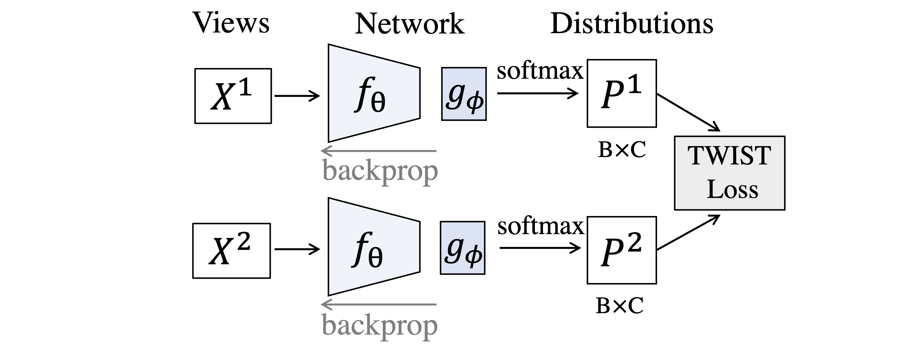
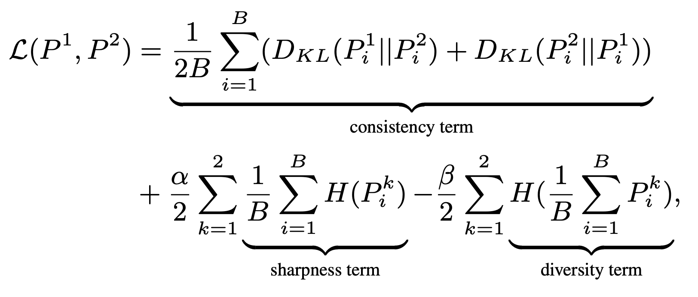
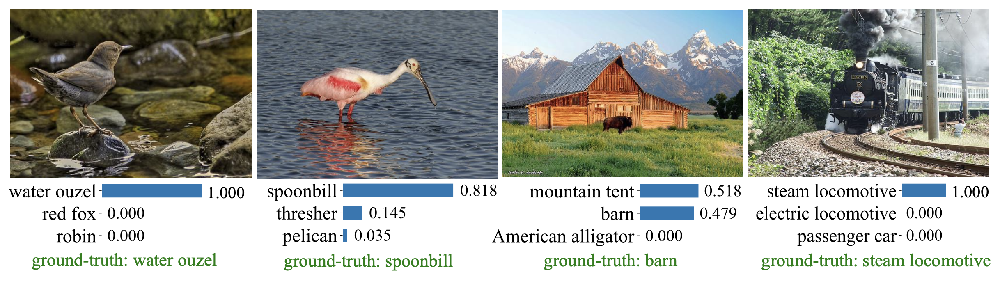

# TWIST: Self-Supervised Learning by Estimating Twin Class Distributions

<p align="center">
    
</p>

Codes and pretrained models for [TWIST](https://arxiv.org/abs/2110.07402):
```
@article{wang2021self,
  title={Self-Supervised Learning by Estimating Twin Class Distributions},
  author={Wang, Feng and Kong, Tao and Zhang, Rufeng and Liu, Huaping and Li, Hang},
  journal={arXiv preprint arXiv:2110.07402},
  year={2021}
}
```

<p style="text-align:justify; text-justify:inter-ideograph;">
TWIST is a novel self-supervised representation learning method by classifying large-scale unlabeled datasets in an end-to-end way. We employ a siamese network terminated by a softmax operation to produce twin class distributions of two augmented images.  Without supervision, we enforce the class distributions of different augmentations to be consistent. In the meantime,  we regularize the class distributions to make them sharp and diverse. TWIST can naturally avoid trivial solutions without specific designs such as asymmetric network, stop-gradient operation, or momentum encoder.
</p>

<p align="center">
    
</p>

## Models and Results

#### Main Models for Representation Learning
<table>
  <tr>
    <th>arch</th>
    <th>params</th>
    <th>epochs</th>
    <th>linear</th>
    <th colspan="5">download</th>
  </tr>
  <tr>
    <th colspan='9'> Model with multi-crop and self-labeling </th>
  </tr>
  <tr>
    <td>ResNet-50</td>
    <td>24M</td>
    <td>850</td>
    <td>75.5%</td>
    <td><a href="https://drive.google.com/file/d/1tiLZmsTPJWZ_Et25WRYPYC9f-BDYceNC/view?usp=sharing">backbone only</a></td>
    <td><a href="https://drive.google.com/file/d/1vD4Nm87eH9Fj9ac95X0auqokWZnep3dZ/view?usp=sharing">full ckpt</a></td>
    <td><a href="https://drive.google.com/file/d/1GVP_rTGUsUQ9oLKTTsqDS1fq0gHjQ0eO/view?usp=sharing">args</a></td>
    <td><a href="https://drive.google.com/file/d/1VNp0auvT5Z42XtW8Oqi2ofkPjz3OMI8J/view?usp=sharing">log</a></td>
    <td><a href="https://drive.google.com/file/d/1xlGm3pQCmEHhao9-cO7bPdtp30oDHFan/view?usp=sharing">eval logs</a></td>
  </tr>
  <tr>
    <td>ResNet-50w2</td>
    <td>94M</td>
    <td>250</td>
    <td>77.7%</td>
    <td><a href="https://drive.google.com/file/d/1abIQMzRZCi3kAqygEQuX3f4_e8pATWhY/view?usp=sharing">backbone only</a></td>
    <td><a href="https://drive.google.com/file/d/1Xrue2j_Jeh0u5gAGycxGXhBBK2C4P4C3/view?usp=sharing">full ckpt</a></td>
    <td><a href="https://drive.google.com/file/d/1VcsJAn2B1zVmqzJh3Azp-EUqa2r3MBcy/view?usp=sharing">args</a></td>
    <td><a href="https://drive.google.com/file/d/19kawGatGDsS_v3scpyWG_SwZjfat0Z3n/view?usp=sharing">log</a></td>
    <td><a href="https://drive.google.com/file/d/1g5e_2qX00An5Xc3_5BuhKCJlBDHr4N0R/view?usp=sharing">eval logs</a></td>
  </tr>
  <tr>
    <td>DeiT-S</td>
    <td>21M</td>
    <td>300</td>
    <td>75.6%</td>
    <td><a href="https://drive.google.com/file/d/1jfOciZQwNjqZOpqy7iedbzrI08W3L05r/view?usp=sharing">backbone only</a></td>
    <td><a href="https://drive.google.com/file/d/1EQKFRyO8iQ0Ibb-jaVcqRynwzam5jyhg/view?usp=sharing">full ckpt</a></td>
    <td><a href="https://drive.google.com/file/d/1ye_zm4rv0AMTB0uySmQqk_qIRcczscop/view?usp=sharing">args</a></td>
    <td><a href="https://drive.google.com/file/d/1atp5OHilqQD9t4v4iLBrSQkLdBtFmMR-/view?usp=sharing">log</a></td>
    <td><a href="https://drive.google.com/file/d/1LhRCGweXlhmQv3HdDWsIK8FYQNhnwqmK/view?usp=sharing">eval logs</a></td>
  </tr>
  <tr>
    <td>ViT-B</td>
    <td>86M</td>
    <td>300</td>
    <td>77.3%</td>
    <td><a href="https://drive.google.com/file/d/1FCe7TZ2P0f-hOwzL_PbegVQX6PYyaaFn/view?usp=sharing">backbone only</a></td>
    <td><a href="https://drive.google.com/file/d/1OlvWDBkoHgWyza3OcKxo6JdPVrEf3j9w/view?usp=sharing">full ckpt</a></td>
    <td><a href="https://drive.google.com/file/d/1XKkXBpbJpWkO2hoyxtuKl2ssQGcZ6JrU/view?usp=sharing">args</a></td>
    <td><a href="https://drive.google.com/file/d/1Cq_boQ-WasFK9D2DmA2rq6XRWZzm9nUC/view?usp=sharing">log</a></td>
    <td><a href="https://drive.google.com/file/d/1qjSgIDmxMPgoP7ReW_fdPwxETOU3c4rW/view?usp=sharing">eval logs</a></td>
  </tr>
    <th colspan='9'> Model without multi-crop and self-labeling </th>
  <tr>
    <td>ResNet-50</td>
    <td>24M</td>
    <td>800</td>
    <td>72.6%</td>
    <td><a href="https://drive.google.com/file/d/17D4gXszqiUqcY4HUOtQLXUiXN5WijOaw/view?usp=sharing">backbone only</a></td>
    <td><a href="https://drive.google.com/file/d/1KnWH2HJCP9oFYIGZN-XAHtYquevYQlo5/view?usp=sharing">full ckpt</a></td>
    <td><a href="https://drive.google.com/file/d/1qpT_fslhYwpi0yymuGgHAEQ_83tTSAFH/view?usp=sharing">args</a></td>
    <td><a href="https://drive.google.com/file/d/14-iEp67anKvRiK4wthz4pRp6ARq7cwr_/view?usp=sharing">log</a></td>
    <td><a href="https://drive.google.com/file/d/1lvQqJ_Fi_nJp4c0Yuuxu5MNNfoa5FP3Z/view?usp=sharing">eval logs</a></td>
  </tr>

</table>

#### Model for unsupervised classification 
 <table>
  <tr>
    <th>arch</th>
    <th>params</th>
    <th>epochs</th>
    <th>NMI</th>
    <th>AMI</th>
    <th>ARI</th>
    <th>ACC</th>
    <th colspan="4">download</th>
  </tr>
  <tr>
    <td>ResNet-50</td>
    <td>24M</td>
    <td>800</td>
    <td>74.4</td>
    <td>57.7</td>
    <td>30.1</td>
    <td>40.5</td>
    <td><a href="https://drive.google.com/file/d/1JowSAen3ldpJv9bHsCko_bsCKuXP4ban/view?usp=sharing">backbone only</a></td>
    <td><a href="https://drive.google.com/file/d/1jJLJRnIn_cwT2aekMiPeyMD98HHrsVJ-/view?usp=sharing">full ckpt</a></td>
    <td><a href="https://drive.google.com/file/d/1th1oFWhLTVS3IhoguJLSmndD0o92204Q/view?usp=sharing">args</a></td>
    <td><a href="https://drive.google.com/file/d/1PnyehAZG_bAQI7lCuu2Mn9XfhXJcXiuv/view?usp=sharing">log</a></td>
  </tr>
</table>

##### Top-3 predictions for unsupervised classification




#### Semi-Supervised Results
<table>
  <tr>
    <th>arch</th>
    <th>1% labels</th>
    <th>10% labels</th>
    <th>100% labels</th>
  </tr>
  <tr>
    <td>resnet-50</td>
    <td>61.5%</td>
    <td>71.7%</td>
    <td>78.4%</td>
  </tr>
  <tr>
    <td>resnet-50w2</td>
    <td>67.2%</td>
    <td>75.3%</td>
    <td>80.3%</td>
  </tr>
</table> 


#### Detection Results
<table>
  <tr>
    <th>Task</th>
    <th>AP all</th>
    <th>AP 50</th>
    <th>AP 75</th>
  </tr>
  <tr>
    <td>VOC07+12 detection</td>
    <td>58.1</td>
    <td>84.2</td>
    <td>65.4</td>
  </tr>
  <tr>
    <td>COCO detection</td>
    <td>41.9</td>
    <td>62.6</td>
    <td>45.7</td>
  </tr>
  <tr>
    <td>COCO instance segmentation</td>
    <td>37.9</td>
    <td>59.7</td>
    <td>40.6</td>
  </tr>
</table> 


## Single-node Training
ResNet-50 (requires 8 GPUs, Top-1 Linear 72.6%)
```
python3 -m torch.distributed.launch --nproc_per_node=8 --use_env train.py \
  --data-path ${DATAPATH} \
  --output_dir ${OUTPUT} \
  --aug barlow \
  --batch-size 256 \
  --dim 32768 \
  --epochs 800 
```

## Multi-node Training
ResNet-50 (requires 16 GPUs spliting over 2 nodes for multi-crop training, Top-1 Linear 75.5%)
```
python3 -m torch.distributed.launch --nproc_per_node=8 --use_env \
  --nnodes=${WORKER_NUM} \
  --node_rank=${MACHINE_ID} \
  --master_addr=${HOST} \
  --master_port=${PORT} train.py \
  --data-path ${DATAPATH} \
  --output_dir ${OUTPUT}
```

ResNet-50w2 (requires 32 GPUs spliting over 4 nodes for multi-crop training, Top-1 Linear 77.7%)
```
python3 -m torch.distributed.launch --nproc_per_node=8 --use_env \
  --nnodes=${WORKER_NUM} \
  --node_rank=${MACHINE_ID} \
  --master_addr=${HOST} \
  --master_port=${PORT} train.py \
  --data-path ${DATAPATH} \
  --output_dir ${OUTPUT} \
  --backbone 'resnet50w2' \
  --batch-size 60 \
  --bunch-size 240 \
  --epochs 250 \
  --mme_epochs 200 
```
 
DeiT-S (requires 16 GPUs spliting over 2 nodes for multi-crop training, Top-1 Linear 75.6%)
```
python3 -m torch.distributed.launch --nproc_per_node=8 --use_env \
  --nnodes=${WORKER_NUM} \
  --node_rank=${MACHINE_ID} \
  --master_addr=${HOST} \
  --master_port=${PORT} train.py \
  --data-path ${DATAPATH} \
  --output_dir ${OUTPUT} \
  --backbone 'vit_s' \
  --batch-size 128 \
  --bunch-size 256 \
  --clip_norm 3.0 \
  --epochs 300 \
  --mme_epochs 300 \
  --lam1 -0.6 \
  --lam2 1.0 \
  --local_crops_number 6 \
  --lr 0.0005 \
  --momentum_start 0.996 \
  --momentum_end 1.0 \
  --optim admw \
  --use_momentum_encoder 1 \
  --weight_decay 0.06 \
  --weight_decay_end 0.06 
```

ViT-B (requires 32 GPUs spliting over 4 nodes for multi-crop training, Top-1 Linear 77.3%)
```
python3 -m torch.distributed.launch --nproc_per_node=8 --use_env \
  --nnodes=${WORKER_NUM} \
  --node_rank=${MACHINE_ID} \
  --master_addr=${HOST} \
  --master_port=${PORT} train.py \
  --data-path ${DATAPATH} \
  --output_dir ${OUTPUT} \
  --backbone 'vit_b' \
  --batch-size 64 \
  --bunch-size 256 \
  --clip_norm 3.0 \
  --epochs 300 \
  --mme_epochs 300 \
  --lam1 -0.6 \
  --lam2 1.0 \
  --local_crops_number 6 \
  --lr 0.00075 \
  --momentum_start 0.996 \
  --momentum_end 1.0 \
  --optim admw \
  --use_momentum_encoder 1 \
  --weight_decay 0.06 \
  --weight_decay_end 0.06 
```

## Linear Classification
For ResNet-50
```
python3 evaluate.py \
  ${DATAPATH} \
  ${OUTPUT}/checkpoint.pth \
  --weight-decay 0 \
  --checkpoint-dir ${OUTPUT}/linear_multihead/ \
  --batch-size 1024 \
  --val_epoch 1 \
  --lr-classifier 0.2
```

For DeiT-S
```
python3 -m torch.distributed.launch --nproc_per_node=8 evaluate_vitlinear.py \
  --arch vit_s \
  --pretrained_weights ${OUTPUT}/checkpoint.pth \
  --lr 0.02 \
  --data_path ${DATAPATH} \
  --output_dir ${OUTPUT} \
```

For ViT-B
```
python3 -m torch.distributed.launch --nproc_per_node=8 evaluate_vitlinear.py \
  --arch vit_b \
  --pretrained_weights ${OUTPUT}/checkpoint.pth \
  --lr 0.0015 \
  --data_path ${DATAPATH} \
  --output_dir ${OUTPUT} \
```

## Semi-supervised Learning

#### Command for training semi-supervised classification

1 Percent (61.5%)
```
python3 evaluate.py ${DATAPATH} ${MODELPATH} \
  --weights finetune \
  --lr-backbone 0.04 \
  --lr-classifier 0.2 \
  --train-percent 1 \
  --weight-decay 0 \
  --epochs 20 \
  --backbone 'resnet50'
```
10 Percent (71.7%)
```
python3 evaluate.py ${DATAPATH} ${MODELPATH} \
  --weights finetune \
  --lr-backbone 0.02 \
  --lr-classifier 0.2 \
  --train-percent 10 \
  --weight-decay 0 \
  --epochs 20 \
  --backbone 'resnet50'
```

100 Percent (78.4%)
```
python3 evaluate.py ${DATAPATH} ${MODELPATH} \
  --weights finetune \
  --lr-backbone 0.01 \
  --lr-classifier 0.2 \
  --train-percent 100 \
  --weight-decay 0 \
  --epochs 30 \
  --backbone 'resnet50'
```

## Detection

#### Instruction
1. Install [detectron2](https://github.com/facebookresearch/detectron2/blob/master/INSTALL.md).
2. Convert a pre-trained MoCo model to detectron2's format:
    ```
    python3 detection/convert-pretrain-to-detectron2.py ${MODELPATH} ${OUTPUTPKLPATH}
    ```
3. Put dataset under "detection/datasets" directory, following the [directory structure](https://github.com/facebookresearch/detectron2/tree/master/datasets) requried by detectron2.
4. Training:
    VOC
    ```
    cd detection/
    python3 train_net.py \
      --config-file voc_fpn_1fc/pascal_voc_R_50_FPN_24k_infomin.yaml \
      --num-gpus 8 \
      MODEL.WEIGHTS ../${OUTPUTPKLPATH}
    ```

    COCO
    ```
    python3 train_net.py \
      --config-file infomin_configs/R_50_FPN_1x_infomin.yaml \
      --num-gpus 8 \
      MODEL.WEIGHTS ../${OUTPUTPKLPATH}
    ```

